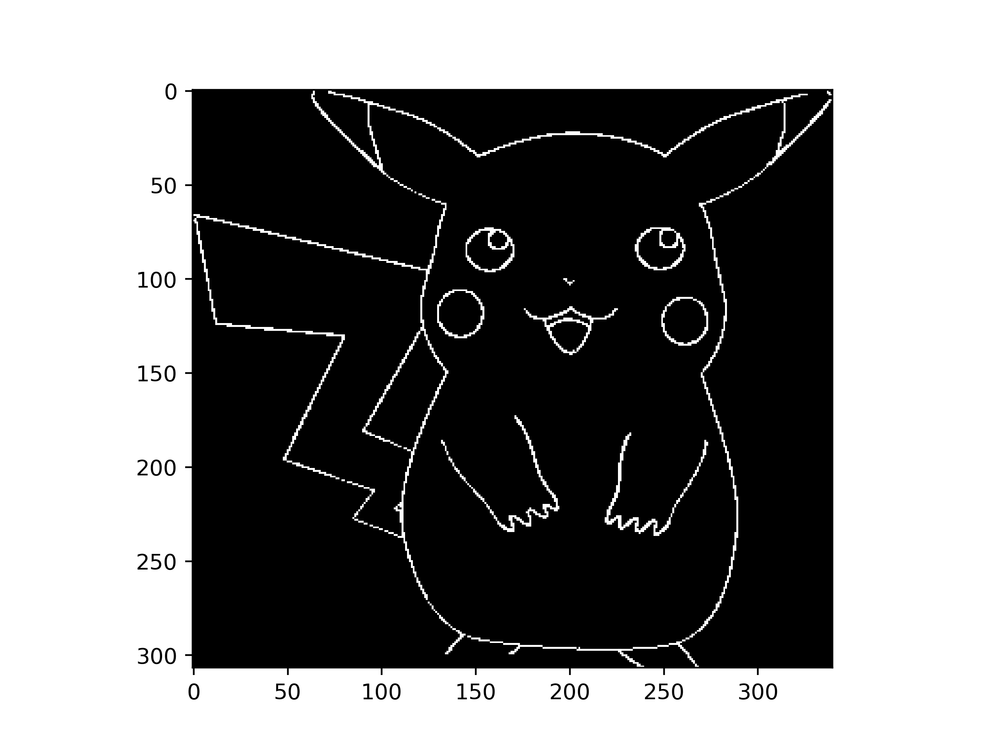

# 基于 ROS/Gazebo 的图像轨迹绘制机器人

这是“工程实践与科技创新 IV-E”课程项目：先从输入图片中提取轮廓并规划连续路径，再通过 PID 双闭环控制、Kalman 状态估计和 Gazebo 仿真，让二维质点机器人沿目标轨迹运动。

> 项目定位：课程实验归档。仓库保留了源码、课程报告、仿真环境、实验图片和演示视频。根据课程报告，图像处理与 Kalman 直线实验已得到预期结果，最终 PID 轨迹跟踪仍存在明显偏差，尚不是可直接用于生产的完整方案。

## 效果预览

<table>
  <tr>
    <td align="center"><br>输入图片</td>
    <td align="center"><br>轮廓提取</td>
  </tr>
  <tr>
    <td colspan="2" align="center"><br>连通图合并、深度优先遍历与 10 m × 10 m 空间归一化</td>
  </tr>
</table>

Kalman 滤波能够在含噪观测下跟踪真实状态：


PID 双闭环实验的估计轨迹与真实轨迹仍存在发散和异常跳变：


演示视频：[Kalman（MP4）](src/video/Kalman.mp4) · [PID（MP4）](src/video/PID.mp4) · [Kalman（WebM）](src/video/Kalman.webm) · [PID（WebM）](src/video/PID.webm)

## 工作原理


系统分为两条流水线：

1. **图像到轨迹**：`get_fig_edge.py` 提取卡通图像的黑色描边，`image_to_list.py` 将边缘像素构造成图，连接各个子图并以深度优先方式生成路径，最后把像素坐标映射到 Gazebo 的 10 m × 10 m 世界。
2. **轨迹到运动**：`controller.py` 依次读取目标点，以位置环输出期望速度、速度环输出加速度；`driver.py` 对质点动力学进行离散化并加入过程噪声；`perception.py` 融合控制量与激光观测，输出状态估计供控制器反馈。

主要 ROS 话题如下：

| 话题 | 消息类型 | 发布者 | 订阅者 | 用途 |
| --- | --- | --- | --- | --- |
| `/robot/control` | `geometry_msgs/Twist` | controller | driver、perception | x/y 方向控制量 |
| `/gazebo/set_model_state` | `gazebo_msgs/ModelState` | driver | Gazebo、perception | 更新并记录模型真实状态 |
| `/robot/observe` | `sensor_msgs/LaserScan` | Gazebo | perception | 由墙面距离构造位置观测 |
| `/robot/esti_model_state` | `gazebo_msgs/ModelState` | perception | controller | Kalman 估计的位置与速度 |

Kalman 状态向量按 `[vx, x, vy, y]ᵀ` 排列。PID 外环分别控制 x/y 位置，内环控制对应速度；代码使用 `Twist.linear.x` 和 `Twist.angular.z` 承载两个方向的控制量。

## 仓库结构

```text
.
├── 2024-工程实践与科技创新IV-E 课程报告.docx
├── 20240506/
│   └── catkin_ws/
│       ├── src/cylinder_robot/       # ROS 包、world、launch、模型与完整实验脚本
│       ├── models/                   # Gazebo 模型副本
│       ├── build/                    # 原环境生成的构建产物，不建议复用
│       └── devel/                    # 原环境生成的开发空间，不建议复用
├── src/
│   ├── code/                         # 核心代码的整理副本
│   ├── plot location/                # 已生成的轨迹数据
│   └── video/                        # 实验演示视频
└── pic/                              # README 与报告使用的结果图
```

实际运行应以 `20240506/catkin_ws/src/cylinder_robot/` 中的 ROS 包为准；根目录下 `src/code/` 主要用于阅读和展示。

## 运行环境

仓库中的构建缓存表明原实验环境为：

- Ubuntu 16.04、ROS Kinetic、catkin；
- Python 2.7；
- Gazebo、`gazebo_ros`、RViz；
- ROS 消息包：`rospy`、`roscpp`、`std_msgs`、`geometry_msgs`、`sensor_msgs`、`gazebo_msgs`；
- Python 库：NumPy、SciPy、Matplotlib、OpenCV、Pandas。

ROS Kinetic 与 Python 2 已停止维护。若需复现实验，建议使用对应版本的虚拟机或容器；直接迁移到较新的 ROS/Python 环境需要修改代码与依赖声明。

## 快速开始

仓库内的 `build/` 和 `devel/` 写入了原机器的绝对路径 `/home/headless/catkin_ws`，不要直接复用。建议只复制源码包并重新构建：

```bash
source /opt/ros/kinetic/setup.bash
mkdir -p ~/catkin_ws/src
cp -r 20240506/catkin_ws/src/cylinder_robot ~/catkin_ws/src/
cd ~/catkin_ws
catkin_make
source devel/setup.bash
```

启动前，修改以下文件中的轨迹绝对路径：

```text
~/catkin_ws/src/cylinder_robot/script/controller.py
```

将 `trajectory_name` 指向复制后包内的轨迹文件，例如：

```python
trajectory_name = '/home/<用户名>/catkin_ws/src/cylinder_robot/script/picachu.txt'
```

随后启动包含 Gazebo、controller、driver 和 perception 的主入口：

```bash
roslaunch cylinder_robot runCylinder.launch
```

仿真结束或节点退出时，`perception.py` 会把估计、真值和观测对比图保存为包目录下的 `fig_x.png`。

## 从图片生成轨迹

仓库已提供可直接使用的 `script/picachu.txt`。若要处理自己的图片，需要先修改脚本中硬编码的文件名和阈值：

```bash
cd ~/catkin_ws/src/cylinder_robot/script
python image_to_list.py
```

处理顺序为：

1. 将图片放入 `script/`，并修改 `image_to_list.py` 中的 `fig_path`；
2. 调整 `img_to_point_list_line()` 的两个 Canny 阈值；
3. 运行 `image_to_list.py`，生成边缘图、规划路径图和归一化 `.npy` 数据；
4. 把一维交错存储的数据重排成每行一组 `(x, y)` 坐标：

   ```bash
   python -c "import numpy as np; a=np.load('picachu.jpg_to_1.npy').reshape(-1,2); np.savetxt('my_trajectory.txt', a)"
   ```

5. 将 `controller.py` 的 `trajectory_name` 指向新文本。

仓库中的 `npy_to_txt.py` 仅直接调用 `np.savetxt()`，它假设输入数组已经是 `N × 2`；对 `image_to_list.py` 当前生成的一维数组，需先执行上面的 `reshape(-1, 2)`。

图像建图包含完整距离矩阵和多层 Python 循环，点数较多时内存和运行时间会快速增长；建议先缩小图片或稀疏采样。

## 已知问题

- `controller.py` 的轨迹路径绑定原作者主目录，换机器后必须修改。
- `runCylinder_1.launch` 含全角引号、错误的 XML 注释符和不可见空格，不能作为可靠入口；请使用 `runCylinder.launch`。
- `package.xml` 尚未完整声明 `geometry_msgs`、`sensor_msgs`、`gazebo_msgs` 等运行依赖，许可证字段仍为 `TODO`。
- controller 的内层目标跟踪循环没有限频，可能占满一个 CPU 核，并大量发布控制消息。
- 图像处理脚本的输入输出文件名彼此硬编码，`.npy` 的形状与文本格式需要人工核对。
- 根目录 `src/code/` 与 ROS 包中的同名脚本并非完全同步，运行和排错时不要混用两套代码。
- `perception.py` 结束时若尚未收到完整的控制、观测或真值数据，数组拼接和绘图可能失败。
- 课程报告记录的最终 PID 实验未达到预期，速度估计、坐标/状态定义和控制参数仍需继续校验。
- 当前没有自动化测试、依赖锁定或持续集成配置。

## 项目资料

- [课程报告](2024-工程实践与科技创新IV-E%20课程报告.docx)：包含算法推导、实验过程、结果分析与成员分工。
- [ROS 包源码](20240506/catkin_ws/src/cylinder_robot/)：可运行主体。
- [核心代码整理版](src/code/)：便于独立阅读图像处理、控制和滤波实现。

## 许可说明

仓库暂未提供明确的开源许可证，`package.xml` 中的 license 仍为 `TODO`。在复用或分发代码前，请先向项目作者确认授权范围。
