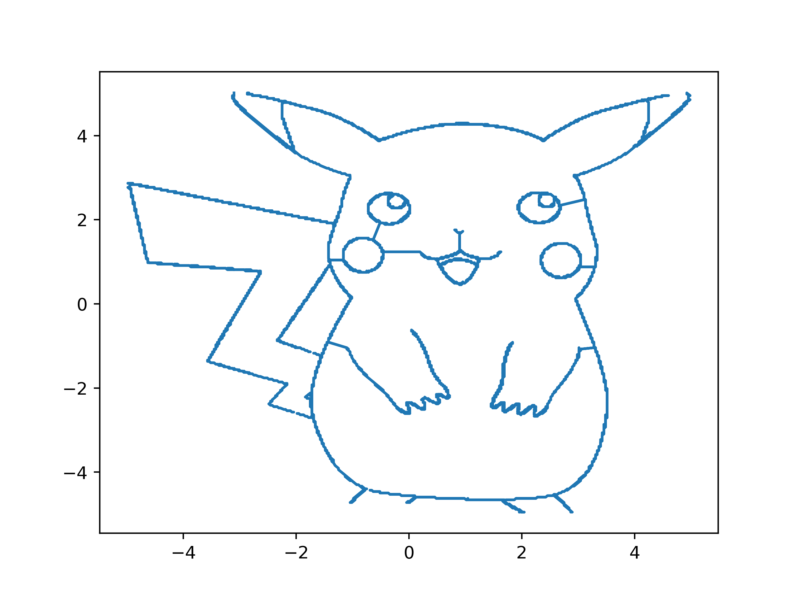
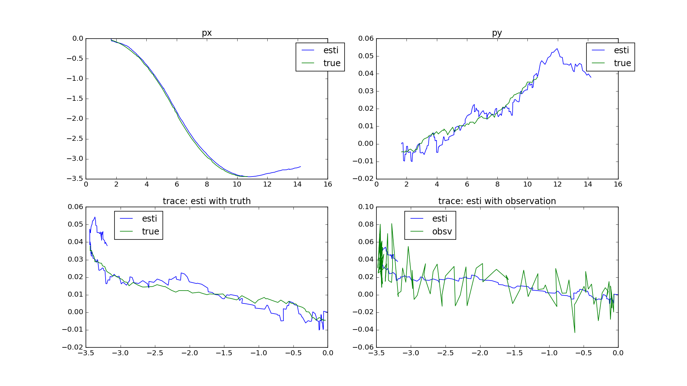
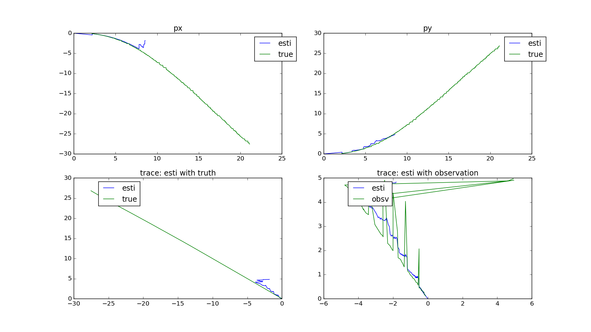
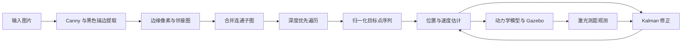

# 基于 ROS/Gazebo 的图像轨迹绘制机器人

这是“工程实践与科技创新 IV-E”课程项目。项目从输入图片中提取轮廓并生成连续路径，再通过 PID 双闭环控制、Kalman 状态估计和 Gazebo 仿真，使二维质点机器人沿目标轨迹运动。

> 本仓库是课程实验归档，包含源码、catkin 工作空间、课程报告、实验图片和演示视频。图像处理与 Kalman 直线实验已得到预期结果；最终 PID 轨迹跟踪仍有明显偏差，不应视为生产级实现。

## 效果预览

<table>
  <tr>
    <td align="center"><br>输入图片</td>
    <td align="center"><br>轮廓提取</td>
  </tr>
  <tr>
    <td colspan="2" align="center"><br>连通图合并、深度优先遍历与 10 m × 10 m 空间归一化</td>
  </tr>
</table>

Kalman 滤波与 PID 实验结果：

| Kalman 状态估计 | PID 双闭环轨迹跟踪 |
| --- | --- |
|  |  |

演示视频：[Kalman（MP4）](data/video/Kalman.mp4) · [PID（MP4）](data/video/PID.mp4) · [Kalman（WebM）](data/video/Kalman.webm) · [PID（WebM）](data/video/PID.webm)

## 工作原理



系统由两部分组成：

1. **图像到轨迹**：`get_fig_edge.py` 提取图像描边，`image_to_list.py` 构造像素邻接图、连接子图并以深度优先方式生成路径，最后将像素坐标映射到 Gazebo 的 10 m × 10 m 世界。
2. **轨迹到运动**：`controller.py` 使用位置环和速度环生成控制量；`driver.py` 计算带过程噪声的离散质点动力学；`perception.py` 融合控制量与激光观测，通过 Kalman 滤波输出状态估计。

主要 ROS 话题：

| 话题 | 消息类型 | 发布者 | 订阅者 | 用途 |
| --- | --- | --- | --- | --- |
| `/robot/control` | `geometry_msgs/Twist` | controller | driver、perception | x/y 方向控制量 |
| `/gazebo/set_model_state` | `gazebo_msgs/ModelState` | driver | Gazebo、perception | 更新并记录模型真实状态 |
| `/robot/observe` | `sensor_msgs/LaserScan` | Gazebo | perception | 根据墙面距离形成位置观测 |
| `/robot/esti_model_state` | `gazebo_msgs/ModelState` | perception | controller | Kalman 估计的位置与速度 |

Kalman 状态向量为 `[vx, x, vy, y]ᵀ`。代码使用 `Twist.linear.x` 和 `Twist.angular.z` 分别承载 x、y 方向的控制量。

## 仓库结构

```text
.
├── README.md
├── data/
│   ├── files/                       # 课程报告（DOCX）
│   ├── pic/                         # 输入图像与实验结果图
│   ├── plot location/               # 已生成的轨迹数据（NPY/TXT）
│   └── video/                       # Kalman 与 PID 演示视频
├── scripts/                         # 核心 Python 脚本的整理副本，便于阅读
└── src/
    ├── building_editor_models/      # Gazebo Building Editor 模型
    └── catkin_ws/
        ├── src/cylinder_robot/      # 可运行的 ROS 包（launch、world、脚本、配置）
        ├── models/                  # Gazebo 模型资源
        ├── worlds/                  # Gazebo world 副本
        ├── build/                   # 原机器生成的 catkin 构建产物
        └── devel/                   # 原机器生成的 catkin 开发空间
```

运行时以 `src/catkin_ws/src/cylinder_robot/` 为准。根目录 `scripts/` 是便于查看的副本，与 ROS 包内脚本并非完全同步，不要混用两套文件。

## 运行环境

仓库中的 CMake 缓存记录了原实验环境：

- Ubuntu 16.04、ROS Kinetic、catkin、Gazebo；
- Python 2.7；
- ROS 包：`gazebo_ros`、`rospy`、`roscpp`、`std_msgs`、`geometry_msgs`、`sensor_msgs`、`gazebo_msgs`；
- Python 库：NumPy、SciPy、Matplotlib、OpenCV、rospkg。

ROS Kinetic 和 Python 2 均已停止维护。最接近原环境的复现方式是使用虚拟机或容器；迁移到较新的 ROS/Python 版本需要修改代码及依赖声明。

## 快速开始

仓库内的 `build/` 和 `devel/` 包含原机器的绝对路径 `/home/headless/catkin_ws`，不能直接复用。请把源码包复制到新的 catkin 工作空间并重新构建：

```bash
source /opt/ros/kinetic/setup.bash
mkdir -p ~/catkin_ws/src
cp -r src/catkin_ws/src/cylinder_robot ~/catkin_ws/src/
cd ~/catkin_ws
catkin_make
source devel/setup.bash
```

随后编辑新工作空间中的 `src/cylinder_robot/script/controller.py`。将 `trajectory_name` 的硬编码路径改为实际轨迹文件，例如：

```python
trajectory_name = '/home/<用户名>/catkin_ws/src/cylinder_robot/script/picachu.txt'
```

启动 Gazebo、controller、driver 和 perception：

```bash
roslaunch cylinder_robot runCylinder.launch
```

停止仿真时，`perception.py` 会尝试将估计、真值和观测对比图写入 ROS 包根目录的 `fig_x.png`。

## 从图片生成轨迹

ROS 包已包含 `script/picachu.txt`。处理自定义图片时，在脚本目录中执行：

```bash
cd ~/catkin_ws/src/cylinder_robot/script
python image_to_list.py
```

处理步骤：

1. 将图片放入当前目录，并修改 `image_to_list.py` 中 `test2()` 的 `fig_path`；
2. 根据图片调整 `img_to_point_list_line()` 的两个 Canny 阈值；
3. 运行脚本，生成边缘图、路径图和归一化后的 `.npy` 数据；
4. 将脚本生成的一维交错数组转换成每行一组 `(x, y)` 坐标：

   ```bash
   python -c "import numpy as np; a=np.load('picachu.jpg_to_1.npy').reshape(-1,2); np.savetxt('my_trajectory.txt', a)"
   ```

5. 将 `controller.py` 的 `trajectory_name` 指向新轨迹文件。

图像建图会创建完整距离矩阵，并包含多层 Python 循环；图片较大或边缘点较密时，内存和运行时间会快速增长。建议先缩小图片或进行稀疏采样。

## 已知问题

- ROS 包中 `controller.py` 的轨迹路径绑定了原作者主目录，换机器后必须修改。
- `controller.py` 的外层条件写成了 `target_index * 0 < self.count`，不会按预期终止；索引最终可能越界。
- controller 的内层目标跟踪循环没有限频，可能占满 CPU 并高频发布控制消息。
- `runCylinder_1.launch` 含有无效 XML 注释符和特殊空白字符；应使用 `runCylinder.launch`。
- `package.xml` 和 `CMakeLists.txt` 未完整声明 `geometry_msgs`、`sensor_msgs`、`gazebo_msgs` 等运行依赖，许可证仍为 `TODO`。
- 图像处理脚本硬编码输入输出文件名；生成的 `.npy` 是一维交错数组，转为文本前需 `reshape(-1, 2)`。
- `perception.py` 退出时若还没有收齐估计、观测或真值数据，拼接数组并绘图可能失败。
- 最终 PID 实验仍有轨迹偏差；状态定义、控制参数和坐标映射需要继续校验。
- 当前没有自动化测试、依赖锁定或持续集成配置。

## 项目资料

- [课程报告](data/files/2024-%E5%B7%A5%E7%A8%8B%E5%AE%9E%E8%B7%B5%E4%B8%8E%E7%A7%91%E6%8A%80%E5%88%9B%E6%96%B0IV-E%20%E8%AF%BE%E7%A8%8B%E6%8A%A5%E5%91%8A.docx)
- [ROS 包源码](src/catkin_ws/src/cylinder_robot/)
- [核心脚本整理版](scripts/)
- [轨迹数据](data/plot%20location/)

## 许可说明

仓库未提供明确的开源许可证，`package.xml` 中的许可证字段仍为 `TODO`。复用或分发代码前，请先向项目作者确认授权范围。
